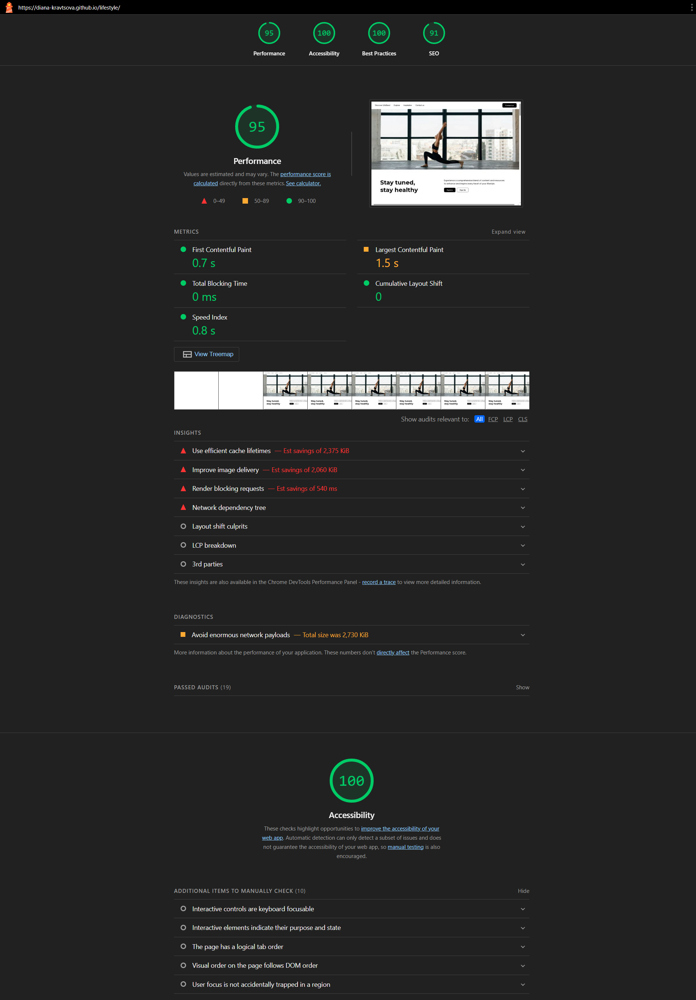
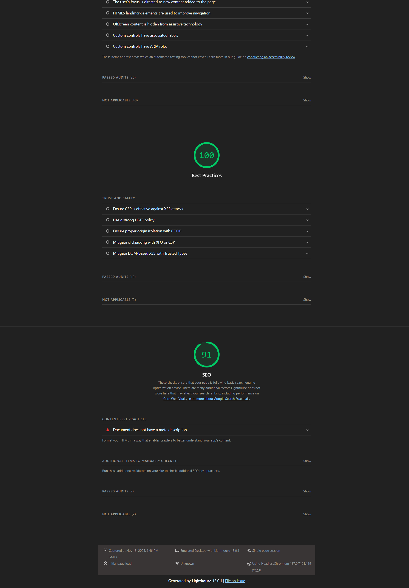
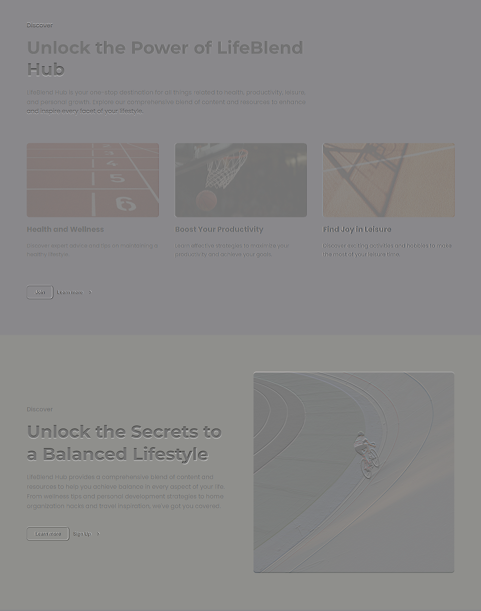
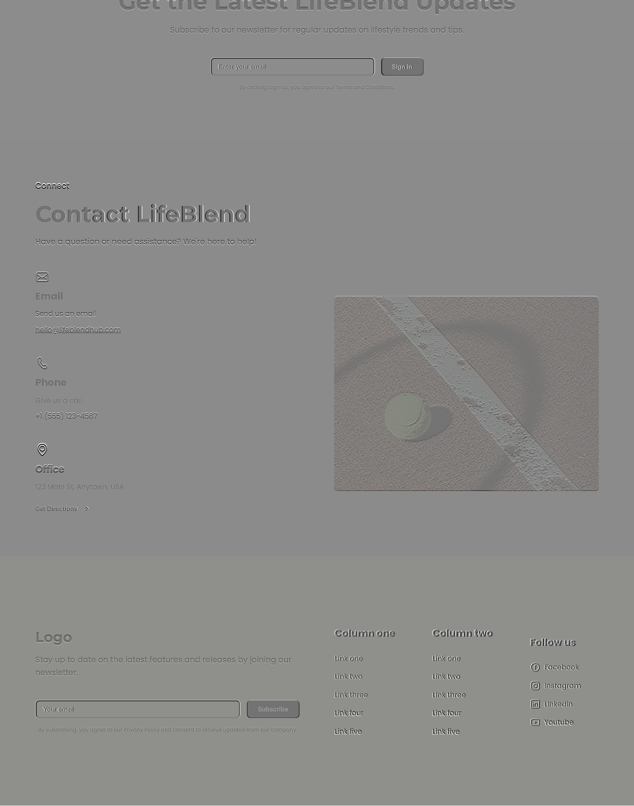

# Lifestyle

[DEMO](https://diana-kravtsova.github.io/lifestyle/)

## 🚀 Project Description
Lifestyle-themed one page site with responsive design.

## 🛠 Technologies

- HTML5
- CSS3

## 🔗 Resources

- Roadmap → [Internet](https://roadmap.sh/frontend).
- Roadmap → [VCS Basics](https://roadmap.sh/frontend).
- Git Tutorial — [W3Schools](https://www.w3schools.com/git/default.asp?remote=github).
- BEM Methodology — [bem.info](https://ru.bem.info/methodology/quick-start/).
- HTML/CSS Reference — [WebRef.ru](https://webref.ru/).

## 📃 Reports

- [WAVE](https://wave.webaim.org/report#/https://diana-kravtsova.github.io/lifestyle/)
- [W3C Validator](https://validator.w3.org/nu/?showimagereport=yes&doc=https%3A%2F%2Fdiana-kravtsova.github.io%2Flifestyle%2F)

<details>
  <summary>Click to see lighthouse report</summary>
  
  
</details>
<details>  
    <summary>Click to see that the page fully matches the layout.</summary>  
      
      
     
    
</details>

## 📦 Installation and launch

```bash
git clone https://github.com/Diana-Kravtsova/lifestyle
cd lifestyle
# Open index.html in the browser
```